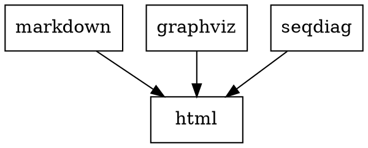

This is a static website generator on top of Pandoc and Make
with built-in Markdown, Gravhiz and Sequence diagrams support.

* [Getting Started](#getting-started)
* [Add Some Styles](#add-some-styles)
* [Reveal.js](#reveal.js)
* [Examples](#examples)
* [Local installation](#local-installation)

Read through [future development plans](todo.md).

## Getting started

**Install Docker.**

1. **Create following folder structure for your website or presentation:**

    ```
    website
    └── source
        └── sample.md
    ```

    by using this command:

    ```bash
    mkdir -p website/source
    touch website/source/sample.md
    ```

2. **Copy and paste this to `source/sample.md`:**

        <style>
          svg {
            width: 400px;
          }
        </style>

        # Hello

        ## Graph

        ```dot
        digraph {
          A -> B
        }
        ```

        ## Sequence graph

        ```seqdiag
        seqdiag {
          browser -> webserver [label = "GET /index.html"];
          browser <-- webserver;
        }
        ```

3. **Then build:**

    ```bash
    cd website
    docker run --rm -v $(pwd):/project nirname/documentary documentary
    ```

    Your will find compiled output under `docs` subfolder. Check the result:

    ```bash
    open docs/sample.html
    ```

As simple as that.

Check other [examples](#examples) below.

**Build script**

To shrink build command create `build.sh` file directly under your `website` folder
and allow its execution:

```bash
touch build.sh
chmod +x build.sh
```

Put the following code inside:

```bash
#!/usr/bin/env bash
docker run --rm -v $(pwd):/project nirname/documentary documentary
```

Then use `./build.sh` command.

**Watcher**

So as to continuously update docs during making changes start watcher:

```bash
#!/usr/bin/env bash
docker run -it --rm -v $(pwd):/project nirname/documentary watcher
```

## Add Some Styles

All the `*.css` files will be automatically included.

Download [Github markdown styles](https://github.com/sindresorhus/github-markdown-css/blob/gh-pages/github-markdown.css), for instance,
and put them under `source` folder. Then build.

## Reveal.js

If you would like to build [reveal.js](https://revealjs.com) presentation, install reveal.js first.
Do this under `website/docs` folder:

```bash
wget https://github.com/hakimel/reveal.js/archive/master.tar.gz
tar -xzvf master.tar.gz
mv reveal.js-master reveal.js
rm master.tar.gz
```

Then build presentation:

```bash
docker run --rm -v $(pwd):/project nirname/documentary documentary TO=revealjs
```

If you are using watcher:

```bash
docker run -it --rm -v $(pwd):/project nirname/documentary watcher TO=revealjs
```

## Examples

### Embedded images

To create embedded graph add specific class to a code block.
Supported class name must coinside with one of Graphviz extenions:
`dot neato fdp sfdp twopi circo`

Use `seqdiag` class to build sequence diagramm.

Copy this code to your `source/sample.md` file:

    **Graphviz**

    ```dot
    digraph workflow {
      node [shape="rect" width=1]
      { Markdown, Graphviz, Sequence } -> html
    }
    ```

    **Sequence diagrams**

    ```seqdiag
    seqdiag {
      make; pandoc; tool [label = "graphviz/seqdiag"];
      make -> pandoc         [label = "markdown"];
              pandoc -> tool [label = "graph"];
              pandoc <- tool [label = "svg"];
      make <- pandoc         [label = "html"];
      make ->           tool [label = "graph"];
      make <-           tool [label = "svg"];
    }
    ```

Then build:

```
docker run -v "`pwd`:/project" -it --rm nirname/documentary documentary
```

Result:

**Graphviz**



**Sequence diagrams**

```seqdiag
seqdiag {
  make; pandoc; tool [label = "graphviz/seqdiag"];
  make -> pandoc         [label = "markdown"];
          pandoc -> tool [label = "graph"];
          pandoc <- tool [label = "svg"];
  make <- pandoc         [label = "html"];
  make ->           tool [label = "graph"];
  make <-           tool [label = "svg"];
}
```

### Standalone images

It might be convenient to keep your graph as a separate file in case it is too big for inline usage.

To add external graph, create file with extension that reflects type of graph you would like to get.
For example, create `formats.neato`.

```bash
touch source/formats.neato
```

Copy and paste this to `formats.neato`:

    ```neato
    digraph Layouts {
      node [shape="plaintext"]
      edge [len=1.1]
      graphviz -> { dot neato fdp sfdp twopi circo }
      blockdiag -> { seqdiag } [len=1.5]
    }
    ```

Paste following code to your `source/sample.md`:

    

Result:


Layout of the image will be derived automatically by source file extension.
`formats.neato` will be converted to `formats.svg` and all the links to it will be automatically changed in resulting HTML as well.

So as to change layout of the graph change source file extension, e.g. `formats.circo`.
Don't forget to change link to the graph to ``.

## Local installation

Clone this project and remove `.git` folder:

```bash
git clone git@github.com:/nirname/documentary.git && cd documentary && rm -rf .git
```

... or [download it](https://github.com/nirname/documentary/archive/master.zip).

Install the requirements as follows.

Pip:

```shell
https://pip.readthedocs.io/en/stable/installing/
```

Ubuntu:


```shell
apt-get install build-essential pandoc graphviz
pip install pandocfilters seqdiag
```

MacOS:

```shell
brew install build-essential pandoc graphviz
pip install pandocfilters seqdiag
```

Use `sudo` if needed.


Put some `*.md`, `*.css` and `*.dot` files under `source/` folder, run:

```shell
make
```

Everything compiled will be under `docs/` folder.

To serve your docs via website run:

```shell
make serve
```

and open `localhost:8000` in your browser.

To watch changes automatically run:

```
make watch
```

in antoher terminal.

To remove `docs` folder completely, run:

```
make clean
```
This is equal to `rm -rf docs/*`