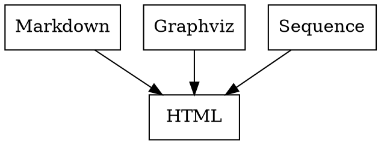

This is a static website generator on top of Pandoc and Make
with built-in Markdown, Gravhiz and Sequence diagrams support.

* [Getting Started](#getting-started)
* [Reveal.js](#reveal.js)
* [Examples](#examples)
* [Local installation](#local-installation)

Read through [future development plans](todo.md).

## Getting started

Install Docker. Then:

```bash
docker pull nirname/documentary
```

Create a new folder for your website:

```bash
mkdir website && cd website
```

Create `sample.md` file under `source` subfolder:

```bash
touch source/sample.md
```

Copy and paste this to `source/sample.md`:

    # Hello

    ```dot
    digraph {
      A -> B
    }
    ```

And build:

```bash
docker run -v "`pwd`:/project" -it --rm nirname/documentary documentary
```

Your will find compiled output under `docs` subfolder. Check the result:

```bash
open docs/sample.html
```

As simple as that. Check other [examples](#examples) below.

## Reveal.js

If you would like to build reveal.js presentation, install reveal.js first.
Do this in your `website` folder:

```bash
wget https://github.com/hakimel/reveal.js/archive/master.tar.gz
tar -xzvf master.tar.gz
mv reveal.js-master reveal.js
rm master.tar.gz
```

Then build presentation:

```bash
docker run --rm -v $(pwd):/project nirname/documentary documentary TO=revealjs
```

## Examples

Just copy and paste these examples to your `source/sample.md` file.

### Inline images

To create embedded graph add specific class to a code block.

---

**Graphviz**

````

````


---

**Sequence diagrams**

````
```seqdiag
seqdiag {
  make; pandoc; tool;
  make -> pandoc         [label = "markdown"];
          pandoc -> tool [label = "graph"];
          pandoc <- tool [label = "svg"];
  make <- pandoc         [label = "html"];
  make ->           tool [label = "graph"];
  make <-           tool [label = "svg"];
}
```
````

```seqdiag
seqdiag {
  make; pandoc; tool;
  make -> pandoc         [label = "markdown"];
          pandoc -> tool [label = "graph"];
          pandoc <- tool [label = "svg"];
  make <- pandoc         [label = "html"];
  make ->           tool [label = "graph"];
  make <-           tool [label = "svg"];
}
```

---

### Standalone images

It might be convenient to keep your graph as a separate file in case it is too big for inline usage.

To add external graph, put in your project `formats.neato` with some valid graph inside and write a link to it:

```markdown


```


Layout of the image will be derived automatically by source file extension.
`formats.neato` will be converted to `formats.svg` and links to it will be automatically changed as well.

So as to change layout of the graph change source file extension, e.g. `formats.circo`.
Don't forget to change link to the graph to ``.

---

## Local installation

Clone this project and remove `.git` folder:

```bash
git clone git@github.com:/nirname/documentary.git && cd documentary && rm -rf .git
```

... or [download it](https://github.com/nirname/documentary/archive/master.zip).

Install the requirements as follows.

Pip:

```shell
https://pip.readthedocs.io/en/stable/installing/
```

Ubuntu:


```shell
apt-get install build-essential pandoc graphviz
pip install pandocfilters seqdiag
```

MacOS:

```shell
brew install build-essential pandoc graphviz
pip install pandocfilters seqdiag
```

Use `sudo` if needed.


Put some `*.md`, `*.css` and `*.dot` files under `source/` folder, run:

```shell
make
```

Everything compiled will be under `docs/` folder.

To serve your docs via website run:

```shell
make serve
```

and open `localhost:8000` in your browser.

To watch changes automatically run:

```
make watch
```

in antoher terminal.

To remove `docs` folder completely, run:

```
make clean
```
This is equal to `rm -rf docs/*`